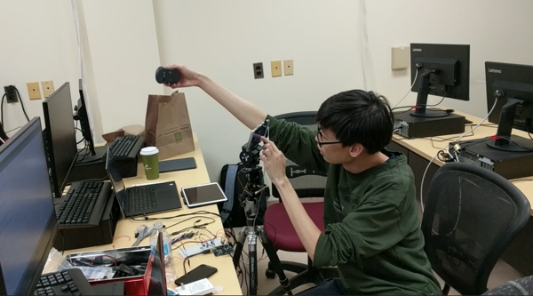

#### Automatic Videography on Android Smartphones w/ Audio Signal

Modern smartphones have camera(s), whose image quality is comparable to professional ones; in addition, these devices are loaded with faster CPU/GPU. With the merriage between imaging capability & computation power, phones can achieve what dedicated cameras / PCs can not achieve. We have seen many great AR apps and games. People would believe that 3D objects are placed in their homes or parks, and no doubt that these objects really exist in real world. This is achieved because game objects are "archored" in a plane in 3D, so that when user move around, the location & orientation of the object will change according to the plane. Under the hood, it is a great camera, a great hardware, and computer vision algorithms that is powering this experience.

Our auto-videography project is inspired by the achievement of AR. But instead of games, we conceived a robotic system. Imagine that you are playing with your kid or dog, and you want to take a video of the happy moment. Instead of asking a friend to help shooting, have you wondered if the camera/phone can shoot the video by itself? Our system enables the phone to track the moving object while taking a video. (i.e., when the object moves, the phone will rotate it self and keep the object in the center of the frame.)   

###### OverLook

Basically, the phone is sitting on a panning/tilting platform, which can be attached on top of a tripod. The phone will determine which object is the "main figure" of the video, which will be handed to the tracking algorithm (the tracker). If the object is moving at time `t`, the tracker will give an instruction to the panning/tilting servos, which will rotate the platform (the phone is rotated since the phone is attached on the platform). Then the tracker will give the next instruction for `(t+dt)`, and so on. 

An Arduino controller will be responsible for (1) receive the motion estimation from the phone, and (2) actuate the servos. The phone will communicate with Arduino using analog Audio signal, through an AUX cable.

###### System Design
*image of system component*
1. (To choose an object), an object detection function will return a list of objects that are in the frame, and a box will be drawn around each detected object. The user can choose the object by selecting a box, or select an area to manually select an object.
2. (After the object is chosen), the pixels within the object box will be input to an OpenCV tracker. For each new camera frame, the OpenCV tracker will return the new position of the box. We can easily compute how much the box deviated from the frame center. Our motion estimation will be the inverse of the deviation.
3. (With motion estimation) 

###### More on OpenCV trackers
TBC

###### Why Analog & Audio for Signal
TBC

###### Demo Video
TBC